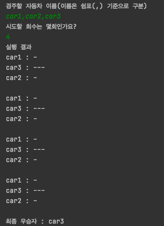

# 자동차 경주 게임 

## 🎮 게임 규칙 🎮

가장 많이 전진한 자동차가 우승하는 게임

- 사용자는 자동차의 이름과 게임 횟수를 입력한다.
- 각 라운드가 진행될 때 마다 자동차의 이름과 전진한 거리를 출력한다.
- 자동차 경주 게임을 완료하면 한 대 이상의 우승자를 출력한다.

<br><br>

##  🚗 기능 🚗

- 사용자 입력 값
    - 쉼표(,)를 기준으로 자동차 이름을 구분하여 입력한다.
        - 사용자는 경기 진행을 위해 두대 이상의 자동차 이름을 입력한다.
        - 쉼표간의 띄어쓰기를 허용하지 않는다.
    - 몇번의 이동을 할 것인지 입력한다.
        - 한번 이상의 라운드만 입력 가능하다.
    - 사용자 입력 예시
    ```html
    경주할 자동차 이름을 입력하세요.(이름은 쉼표(,) 기준으로 구분) 
    pobi,wonj,jun
    시도할 회수는 몇회인가요? 
    3
    ```

- 자동차
    - 자동차는 n대 존재할 수 있다.
    - 자동차는 전진할 수 있다.
    - 자동차는 멈출 수 있다.
    - 자동차에 이름을 부여할 수 있다.
    - 자동차 이름은 5자 이하만 가능하다.
- 전진
    - 0부터 9까지의 random 값을 생성한다.
    - 자동차는 랜덤수 조건에 의해 전진한다.
        - 랜덤수 0~3 : 1칸 전진
        - 랜덤수 4~9 : 정지
    - 자동차 경주 게임이므로 후진할 수 없다.
- 출력 값
    - 자동차가 전진할 때 자동차의 이름과 이동한 거리를 함께 출력한다.
    - 게임이 완료되면 누가 우승했는지 알려준다.
    - 우승자가 한 명 이상일 경우, 쉼표(,)로 이름을 구분해 출력한다.
    - 출력 예시   
    ```html
    실행 결과
    pobi : -
    crong : 
    honux : -
      
    pobi : --
    crong : -
    honux : --
      
    pobi : ---
    crong : --
    honux : ---
      
    최종 우승자 : pobi, honux
    ```

<br><br>


## 🚗💨 실행 예제

