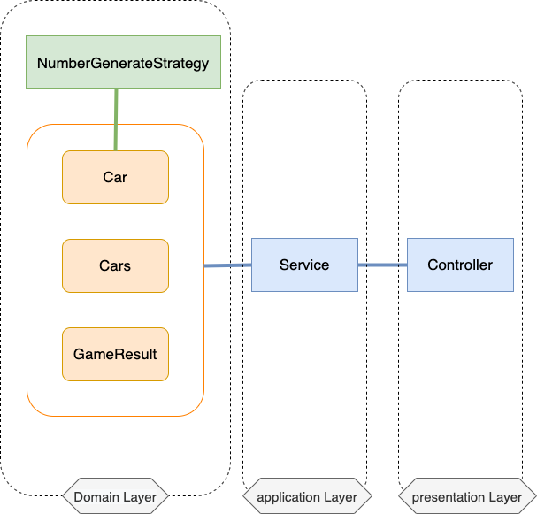

# 설계

## 초기 설계

- Layered Architecture
    - presentation layer    : 사용자로부터 request를 받고 response를 출력하는 계층
    - application layer     : 어플리케이션이 수행할 작업을 정의하고 도메인에게 작업을 위임하는 계층 
    - domain layer          : 핵심 비지니스 로직을 포함하는 계층 
