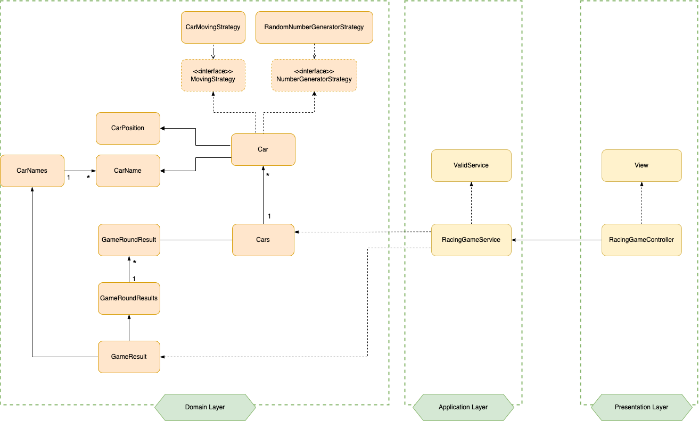

# 설계


## 초기 설계


- Layered Architecture
    - presentation layer    : 사용자로부터 request를 받고 response를 출력하는 계층
    - application layer     : 어플리케이션이 수행할 작업을 정의하고 도메인에게 작업을 위임하는 계층 
    - domain layer          : 핵심 비지니스 로직을 포함하는 계층 


## 최종 설계



##  💻 프로젝트 구조 및 도메인


### 프로젝트 구조ㅅ

```html
-racingcar
  ㄴapplication       : 어플리케이션이 수행할 작업을 정의하고 도메인에게 작업을 위임하는 package 
  ㄴdomain            : 핵심 비지니스 로직을 포함하는 package 
    ㄴcar             : 자동차 관련 비지니스 로직을 포함하는 package
    ㄴgame            : 게임 관련 비지니스 로직을 포함하는 package
    ㄴstrategy        : 게임 전략 로직을 포함하는 package
  ㄴpresentation      : 사용자로부터 request를 받고 response를 출력하는 package
```
<br><br>


### 도메인

- car
  - Car         : 자동차 1대를 나타내는 도메인
  - CarName     : 자동차 이름을 나타내는 Wrapping Class
  - CarPosition : 자동차의 위치를 나타내는 Wrapping Class
  - Cars        : 여러대의 자동차를 나타내는 일급컬렉션
  - CarStatus   : 자동차의 움직임 상태를 나타내는 Enum Class
  <br><br>
    
- game
  - GameResult       : 총 게임 결과를 나타내는 도메인
  - GameRoundResult  : 하나의 게임 라운드 결과를 나타내는 일급컬렉션
  - GameRoundResult  : 여러 게임 라운드 결과를 나타내는 일급컬렉션
  <br><br>
    
- strategy
  - CarMovingStrategy     : 움직임(자동차)을 판단하는 전략
  - RandomNumberStrategy  : 숫자(랜덤)를 생성하는 전략 
  

